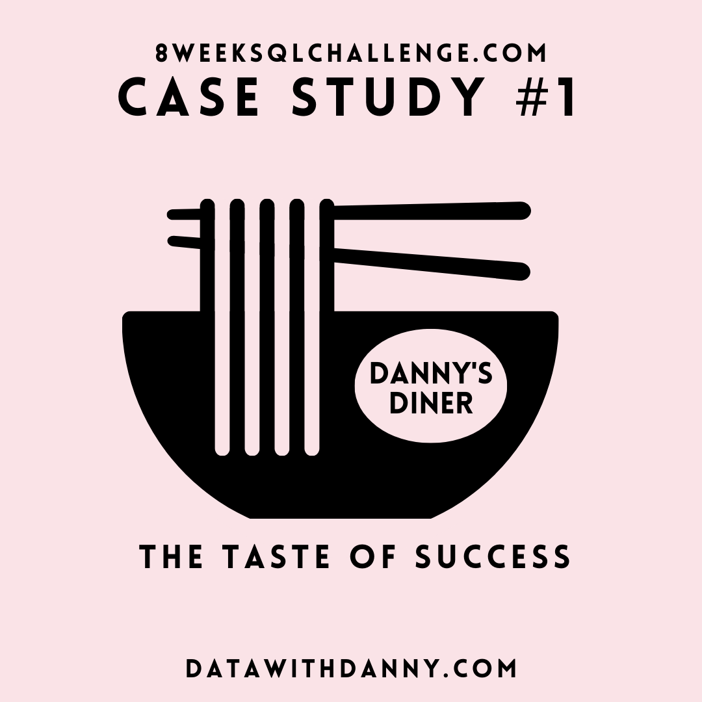
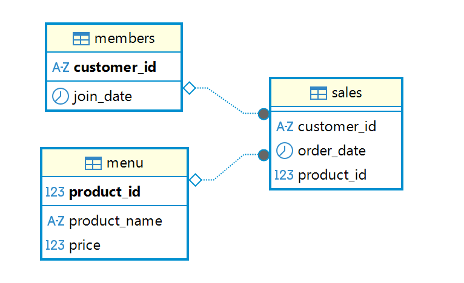

# 🍜 Case Study #1: Danny's Diner
 


## 📚 Table of Contents
- [Business Task](#business-task)
- [Entity Relationship Diagram](#entity-relationship-diagram)
- [Question and Solution](#question-and-solution)

Please note that all the information regarding the case study has been sourced from the following link: [here](https://8weeksqlchallenge.com/case-study-1/). 

## Business Task
Danny wants to use the data to answer a few simple questions about his customers, especially about their visiting patterns, how much money they’ve spent and also which menu items are their favourite. 

## Entity Relationship Diagram

 

***

## Question and Solution

### What is the total amount each customer spent at the restaurant?

````sql
SELECT
````

**Etapes :**

**Réponse :**


### How many days has each customer visited the restaurant?
````sql
SELECT
````

### What was the first item from the menu purchased by each customer?
````sql
SELECT
````

### What is the most purchased item on the menu and how many times was it purchased by all customers?
````sql
SELECT
````

### Which item was the most popular for each customer?
````sql
SELECT
````

### Which item was purchased first by the customer after they became a member?
````sql
SELECT
````

### Which item was purchased just before the customer became a member?
````sql
SELECT
````

### What is the total items and amount spent for each member before they became a member?
````sql
SELECT
````

### If each $1 spent equates to 10 points and sushi has a 2x points multiplier - how many points would each customer have?
````sql
SELECT
````


### In the first week after a customer joins the program (including their join date) they earn 2x points on all items, not just sushi - how many points do customer A and B have at the end of January?
````sql
SELECT
````

